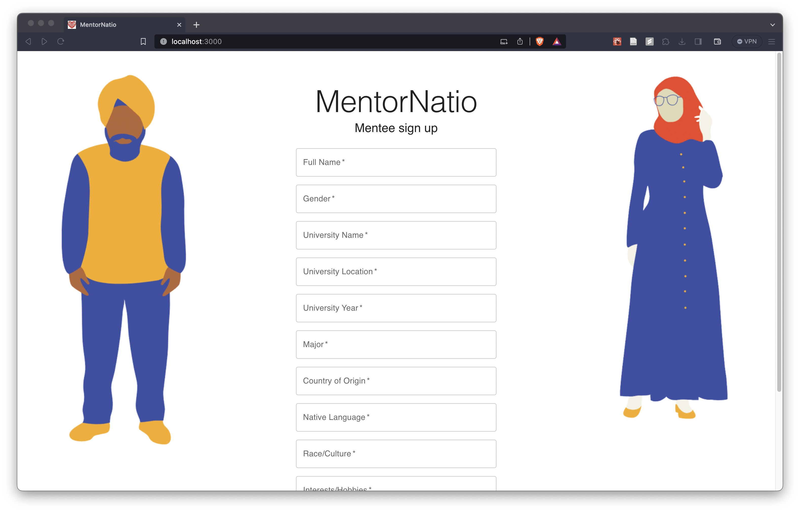
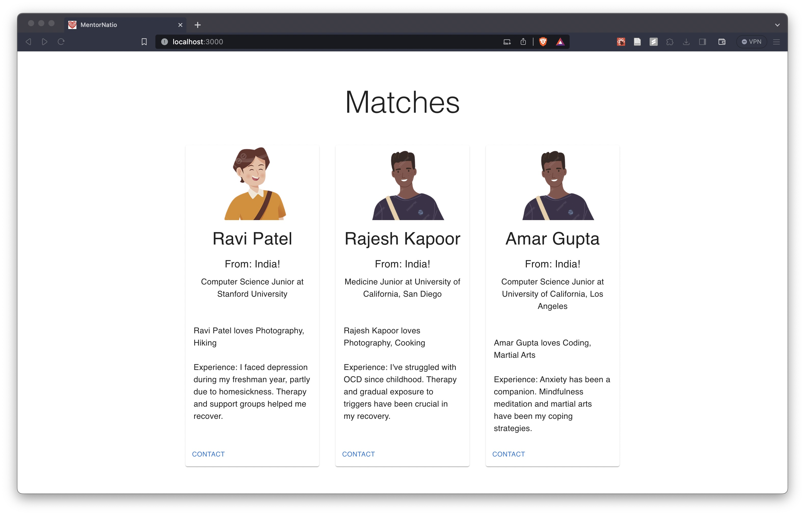

# MentorNatio

## https://github.com/s-leirbag/MentorNatio

Breaking mental health barriers for international students.

Developed at SASEhack 2023! https://devpost.com/software/mentornatio

Uses ChatGPT API, FastAPI, React, MUI.

## Prototype

## Inspiration
In college, we noticed a lot of international students felt that attending college in another country is a very challenging experience. They have their own unique struggles adapting to our culture and language. They often face great pressure to perform well and face issues like homesickness and loneliness.  

We found that they have a much harder time finding mental health help due to language and cultural barriers. We were compelled to provide a simple solution that would help international students in need.

## What it does
Connects international students struggling with mental health to mentors of similar backgrounds who can help them adapt, learn, and open up about their struggles. The pairing is based on their country of origin and displays the bios of potential mentors that the mentee can select from.

## How we built it
React & Material-UI front-end. Back-end was FastAPI using the ChatGPT API to match mentors to the mentee. We fed ChatGPT data on the mentors and asked which mentors matched the mentee best. The back-end took the mentors that matched best and gave them to the front-end.

## Challenges we ran into
We had challenges as a team with different skill levels. 2 of us were not familiar with web development and hackathons and one of us was more experienced. We had to manage helping each other learn and also working efficiently towards a functional prototype.

## Accomplishments that we're proud of
We gained experience with web development. We created a real solution to a real-world problem as inexperienced programmers.

## What we learned
Website development, teamwork, working with teammates with different skills and skill levels

## What's next for MentorNatio
Leveraging AI to match mentors based on other specific characteristics besides nationality. Piloting this website with actual international students within our own college!

## Credits

[FastAPI](https://fastapi.tiangolo.com/)  
[ChatGPT API](https://openai.com/)  
[Create React App](https://github.com/facebook/create-react-app)  
[Material UI](https://mui.com/)  